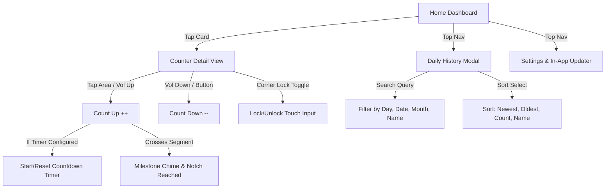

<p align="center">
  
</p>

<h1 align="center">Tally</h1>

<p align="center">
  <b>A clean, ergonomic, and distraction-free tally counter for Android & Web.</b>
</p>

<p align="center">
  <a href="https://github.com/KHILVANSH6789/Tally/releases/latest"></a>
  
  
  
</p>

<p align="center">
  <a href="./apk/Tally.apk"><b>⬇️ Download Latest APK (Tally.apk)</b></a> •
  <a href="https://github.com/KHILVANSH6789/Tally/releases"><b>Releases & Changelog</b></a>
</p>

---

## 🧭 Application Workflow



---

## ✨ Core Features

### ⏱️ Smart Countdown Timers
- Attach an optional countdown timer (15s, 30s, 60s, or custom seconds) to any counter.
- **Lazy Start**: When opening a tally, the timer stays in a ready state until your **first tap or volume count**.
- **Auto-Reset**: Each subsequent count up automatically resets the timer back to full duration. Plays `Time_Up.mp3` when the clock runs out.
- **Home Badges**: Counters configured with a timer display an inline timer pill directly on the home card.

### 🎯 Subdivided Milestone Targets
- Intelligent milestone division tailored to your chosen goal:
  - **Goal 10**: Midpoint milestone at **5** (50%) & goal at **10** (100%).
  - **Goal 100**: Intermediate milestones at **25**, **50**, **75**, and **100**.
  - **Goal 30**: Segmented at **10**, **20**, and **30**.
- Dynamic progress notches render across the progress bar corresponding to each segment.
- Plays gentle split sound (`Goal_Split.mp3`) at intermediate notches and celebratory chime (`Goal_Reached.mp3`) at 100%.

### 🔒 Touch Lock Mode
- Corner toggle inside every counter detail screen lets you lock screen touches to prevent accidental double-counts while walking or exercising.
- Physical volume buttons continue counting smoothly while touch is locked.

### 🔍 Daily History with Search & Multi-Sort
- View past counts automatically archived each night at midnight (optional toggle).
- **Live Search**: Search entries by weekday (*"Monday"*), month (*"September"*), date numbers, or counter name.
- **Sort Options**: Order logs by *Newest First*, *Oldest First*, *Highest Count*, *Lowest Count*, or *Alphabetical (A-Z)*.

### 🚀 Built-In GitHub Updater
- Check for updates and download new releases straight from the GitHub repository within the app.
- Native background downloader with progress indicator and package installer trigger.

### 🎨 360° Interactive Hex Color Wheel
- Customize each counter with an interactive color wheel canvas and live hex input box (`#RRGGBB`).
- Clean visual distinction for habits, fitness reps, prayers, or study sessions.

### 🔊 Audio & Volume Keys Control
- Optional hardware volume button counting (Volume Up = count up, Volume Down = count down).
- Uses device media volume rather than forced levels.
- Rapid sound effect pooling (`Tap_Normal.mp3`, `Tap_Decrease.mp3`, `Goal_Reached.mp3`, `Goal_Split.mp3`, `Time_Up.mp3`).

---

## 🛠️ Tech Stack

| Component | Technology |
|:---|:---|
| **Frontend** | Vanilla JavaScript (ES Modules), HTML5, CSS3 Variables |
| **Mobile Runtime** | [Capacitor 7](https://capacitorjs.com/) with native Android bridge |
| **Styling** | Custom responsive dark theme, CSS Grid & Flexbox |
| **Platform Target** | Android SDK 34+ (Java 17 OpenJDK) & Modern Browsers |

---

## 💻 Local Development

```bash
# Clone the repository
git clone https://github.com/KHILVANSH6789/Tally.git
cd Tally

# Install dependencies
npm install

# Run Vite dev server
npm run dev
```

---

## 📦 Building the Android APK

```bash
# 1. Compile web bundle
npm run build

# 2. Sync web assets with Capacitor
npx cap sync android

# 3. Assemble Android Debug APK
cd android
./gradlew assembleDebug

# Output APK:
# android/app/build/outputs/apk/debug/app-debug.apk
```

---

## 📄 License

Open-source under the [MIT License](LICENSE). Contributions, bug reports, and suggestions are always welcome!
